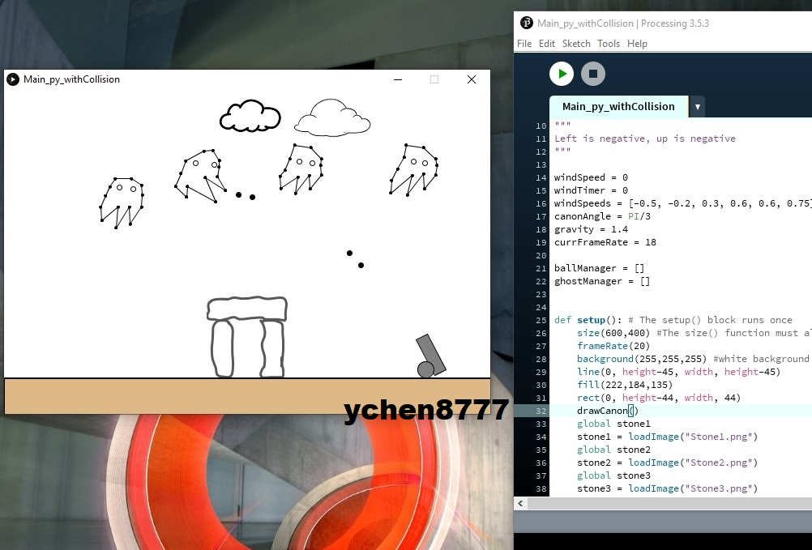
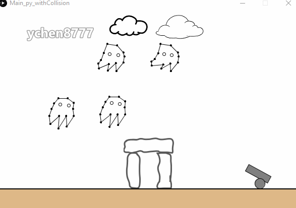
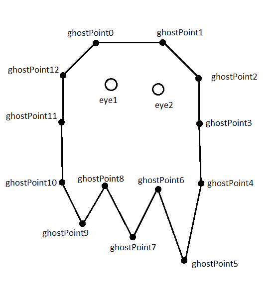
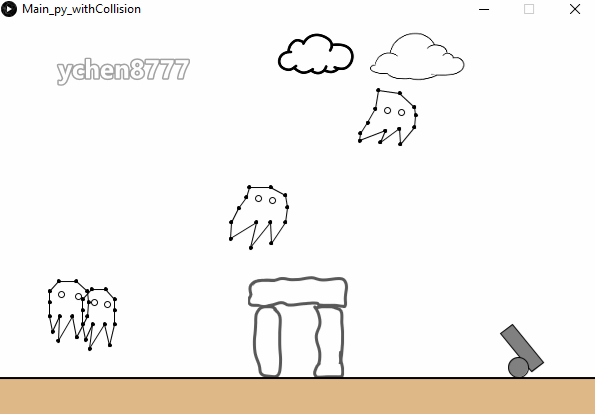

# 2D_physics_Sim
A 2D game with self-defined physics engine

The game was developed in **Python**, running in Processing 3. The purpose of the program is to model **projectile physics** as well as **collision detection/resolution** strategy.
The game terrain includes a flat ground, a stonehenge in the center, a canon, clouds, and floating ghosts.

The stones and clouds are image files. The movement of clouds indicates wind over the stonehenge.
The canon and ghosts are drawn with basic shapes, such as line, circle, and rectangle, provided by Processing 3.

The aiming position of the canon and firing of canonball can be controlled by keyboard. The motion of canonball is modelled using projectile physics incorporating initial velocity, barrel angle, gravity, and wind over the stonehenge. The postion of canonball is calculated with **Euler Integration**.

The canonball would bounce if it hits the stone. If hitted by a canonball, a ghost would absorb the ball and move along the force of the ball.

Ghosts are spawned at random locations left of the stonehenge. Each ghost is represented by lines and points, as illustrated below. The motion of the ghost is modelled with **Verlet Integration**, under which constraints are enforced on each point relative to other points. This gives the ghost a floppy appearance, while maintaining its recognizable structure.

